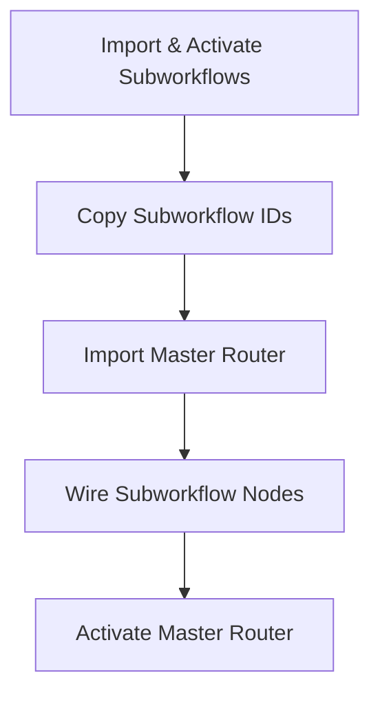

# Nexus OJT Tracker — Automation & n8n Deployment Guide

This document provides complete, step-by-step instructions for deploying and configuring **n8n on Railway**, setting up environment variables, and importing/wiring up the automation workflows for **Nexus OJT Tracker**.

---

## 1. Overview of Architecture

The Nexus automation layer uses an event-driven architecture:
1. **Next.js App (Client/Server)** emits domain events (e.g. `user.created`, `task.assigned`, `task.completed`) via `emitEvent()` to the central gateway `/api/automation/events`.
2. **Next.js Gateway** sends an HTTP POST request envelope to the **n8n Webhook endpoint** (`/webhook/events`).
3. **n8n Master Router** (`nexus-master-router-v2.json`) receives the webhook, normalizes the event payload, and uses a Domain Switch node to route it to the appropriate subworkflow.
4. **Subworkflows** (`nexus-sub-users.json`, `nexus-sub-kanban.json`, etc.) execute domain-specific logic and make authenticated HTTP requests back to the Next.js API endpoints (`/api/automation/workflows/*`).
5. **Next.js Workflow Routes** render transactional React Email templates (`WelcomeEmail`, `TaskAssignedEmail`, `TaskCompletedEmail`) and deliver them using **Resend**.

---

## 2. Deploying n8n on Railway

### Step 1: Create a Railway Project
1. Log in to your [Railway Dashboard](https://railway.app/).
2. Click **+ New Project**.
3. Select **Deploy from Template** and search for `n8n` (or choose **Empty Project** and add an image).
4. If using an image:
   - Click **+ New** -> **Docker Image**.
   - Set image name: `docker.io/n8nio/n8n:latest`.

### Step 2: Attach PostgreSQL Database (For Persistent Workflows)
1. In your Railway project canvas, click **+ New** -> **Database** -> **Add PostgreSQL**.
2. Go to your **n8n service** in Railway -> **Variables** tab -> Reference the Postgres variables so n8n connects to Postgres instead of ephemeral SQLite.

---

### Step 3: Configure Environment Variables in Railway
Add the following variables to your **n8n service** in Railway:

#### Database Persistence Settings (Prevents Reset on Redeploy)
> [!IMPORTANT]
> By default, n8n uses SQLite stored in container memory, which gets **wiped on every redeploy**. To persist your login account and imported workflows permanently, you **MUST** set `DB_TYPE=postgresdb` and configure the following:

| Variable | Value in Railway | Description |
| :--- | :--- | :--- |
| `DB_TYPE` | `postgresdb` | **CRITICAL:** Tells n8n to use PostgreSQL instead of SQLite |
| `DB_POSTGRESDB_HOST` | `${{ Postgres.RAILWAY_PRIVATE_DOMAIN }}` | Railway internal DB host |
| `DB_POSTGRESDB_PORT` | `5432` | Postgres port |
| `DB_POSTGRESDB_DATABASE` | `${{ Postgres.POSTGRES_DB }}` | Database name |
| `DB_POSTGRESDB_USER` | `${{ Postgres.POSTGRES_USER }}` | Database user |
| `DB_POSTGRESDB_PASSWORD` | `${{ Postgres.POSTGRES_PASSWORD }}` | Database password |

DB_TYPE=postgresdb
DB_POSTGRES_HOST=${{ Postgres.RAILWAY_PRIVATE_DOMAIN }}
DB_POSTGRESDB_PORT=5432
DB_POSTGRESDB_USER=${{ Postgres.POSTGRES_USER }}
DB_POSTGRESDB_PASSWORD=${{ Postgres.POSTGRES_PASSWORD }}

*(Alternative: You can also attach a **Railway Volume** mounted to `/home/node/.n8n` if you prefer persistent file storage).*

#### Core n8n Settings
| Variable | Value | Description |
| :--- | :--- | :--- |
| `N8N_PORT` | `5678` | Internal port n8n listens on |
| `PORT` | `5678` | Railway public port mapping |
| `N8N_PROTOCOL` | `https` | Protocol for public URLs |
| `N8N_HOST` | `n8n-production-xxxx.up.railway.app` | Your Railway domain (without `https://`) |
| `WEBHOOK_URL` | `https://n8n-production-xxxx.up.railway.app/` | Public base URL for n8n webhooks |

#### Critical Environment Access Settings (MUST SET)
> [!IMPORTANT]
> By default, self-hosted n8n blocks access to environment variables inside expressions (`$env.VARIABLE`). You **MUST** add these variables, otherwise your workflow nodes will throw `"ExpressionError: access to env vars denied"`.

| Variable | Value | Description |
| :--- | :--- | :--- |
| `N8N_BLOCK_ENV_ACCESS_IN_NODE` | `false` | **CRITICAL:** Allows workflows to read `$env` variables |
| `N8N_ENFORCE_SETTINGS_FILE_PERMISSIONS` | `true` | Required for secure file permissions |
| `N8N_ENV_VARS_IN_EXPRESSIONS` | `true` | Enables `$env` syntax inside expressions |

#### Application & Integration Environment Variables
Add these custom variables to Railway so n8n workflows can reference them dynamically via `$env`:

| Variable | Recommended Value / Example | Description |
| :--- | :--- | :--- |
| `NEXUS_APP_URL` | `https://nexxus.lol` | Base URL of your Next.js application |
| `N8N_API_KEY` | *(Any random secret string)* | **Shared Secret Key** generated by you (e.g., a random 64-char hex string) to authenticate n8n -> Next.js calls |
| `EMAIL_FROM` | `Nexus <noreply@nexxus.lol>` | Default sender display name and address for emails |

> [!NOTE]
> **What is `N8N_API_KEY`?**
> `N8N_API_KEY` is a **custom shared secret key that YOU create** (it is not generated by n8n or an external vendor). 
> You can generate any long random string (e.g. via `openssl rand -hex 32` or a random password generator). Set this **same exact key** in both your Next.js environment (`.env.local` / Vercel) and your Railway n8n environment variables.


---

## 3. Workflow Import & Setup Order

To avoid broken subworkflow references in n8n, workflows **MUST** be imported in the following order:



### Step 1: Import all Subworkflows
In n8n UI, click **Workflows** -> **Import from File** for each file in the `/workflows` directory:

1. `nexus-sub-users.json` -> Rename/Verify name: `Nexus — Users Automations`
2. `nexus-sub-kanban.json` -> Rename/Verify name: `Nexus — Kanban Automations`
3. `nexus-sub-attendance.json` -> Rename/Verify name: `Nexus — Attendance Automations`
4. `nexus-sub-reports.json` -> Rename/Verify name: `Nexus — Reports Automations`
5. `nexus-sub-organizations.json` -> Rename/Verify name: `Nexus — Organizations Automations`
6. `nexus-master-router-v2.json` -> Rename/Verify name: `Nexus — Master Router`

### Step 2: Activate Subworkflows
- Open each of the 5 subworkflows.
- Toggle the **Active** switch in the top-right corner to **ON** (Enabled).
- Save each workflow.

### Step 3: Copy Subworkflow IDs
For each subworkflow, look at your browser's URL bar while viewing the workflow:
`https://n8n-production-xxxx.up.railway.app/workflow/` **`1234abc`**
Copy the unique ID string (`1234abc`) for each of the 5 subworkflows.

### Step 4: Import Master Router Workflow
- Import `workflows/nexus-master-router-v2.json` into n8n.
- Name: `Nexus — Master Router`.

### Step 5: Wire Subworkflows into Master Router
Open `Nexus — Master Router` and edit each **Execute Workflow** node:

1. Double click **Execute Workflow - Users**:
   - Select `Nexus — Users Automations` from the dropdown list (or paste its ID).
2. Double click **Execute Workflow - Kanban**:
   - Select `Nexus — Kanban Automations`.
3. Double click **Execute Workflow - Attendance**:
   - Select `Nexus — Attendance Automations`.
4. Double click **Execute Workflow - Reports**:
   - Select `Nexus — Reports Automations`.
5. Double click **Execute Workflow - Organizations**:
   - Select `Nexus — Organizations Automations`.

### Step 6: Activate Master Router
- Toggle the **Active** switch on `Nexus — Master Router` to **ON**.
- Save the workflow.

---

## 4. End-to-End Event & API Mapping

The table below summarizes how events flow through the n8n router down to the Next.js API endpoints:

| Domain Event | n8n Router Branch | Subworkflow Node | Target Next.js Endpoint |
| :--- | :--- | :--- | :--- |
| `user.created` | Users | Welcome Email | `POST {{ $env.NEXUS_APP_URL }}/api/automation/workflows/welcome-email` |
| `task.assigned` | Kanban | Task Assignment Email | `POST {{ $env.NEXUS_APP_URL }}/api/automation/workflows/task-assignment` |
| `task.completed` | Kanban | Task Completion Email | `POST {{ $env.NEXUS_APP_URL }}/api/automation/workflows/task-completion` |
| `attendance.*` | Attendance | (Placeholder Node) | Ready for future automation |
| `report.*` | Reports | (Placeholder Node) | Ready for future automation |
| `organization.*` | Organizations | (Placeholder Node) | Ready for future automation |

### HTTP Request Node Configuration Pattern
For any n8n HTTP Request node making calls to the Next.js application backend, ensure the following parameters are set:
- **Method:** `POST`
- **URL:** `{{ $env.NEXUS_APP_URL }}/api/automation/workflows/<workflow-name>`
- **Headers:**
  - `Content-Type`: `application/json`
  - `X-Automation-Key`: `{{ $env.N8N_API_KEY }}`
- **Body Content Type:** `JSON`
- **JSON:** `{{ $json }}`

---

## 5. Next.js App Environment Setup (.env.local / Vercel)

Ensure your Next.js project has these variables configured in `.env.local` and in your Vercel Project Settings:

```env
# Database & Supabase
NEXT_PUBLIC_SUPABASE_URL=https://<your-project>.supabase.co
NEXT_PUBLIC_SUPABASE_ANON_KEY=your_anon_key
SUPABASE_SERVICE_ROLE_KEY=your_service_role_key
DATABASE_CONNECTION_STRING=postgresql://postgres:<password>@db.<project>.supabase.co:5432/postgres

# Application URL & Branding
NEXT_PUBLIC_SITE_URL=https://nexxus.lol
EMAIL_FROM="Nexus <noreply@nexxus.lol>"

# Resend Email Integration
RESEND_API_KEY=re_xxxxxxxxxxxxxxxx

# n8n Automation Integration
N8N_URL=https://n8n-production-xxxx.up.railway.app
N8N_API_KEY=af5f62c36892221962ff70ba28c38747e72f5f4ff1ba6eb19717cb7d33fe1bcc
AUTOMATION_ENABLED=true
AUTOMATION_LOG_LEVEL=full
AUTOMATION_TIMEOUT=10000
AUTOMATION_RETRIES=3
```

---

## 6. Common Gotchas & Troubleshooting

> [!WARNING]
> **Issue: `ExpressionError: access to env vars denied`**
> - **Cause:** n8n environment variable security blocks `$env` expressions by default.
> - **Fix:** Add `N8N_BLOCK_ENV_ACCESS_IN_NODE=false` and `N8N_ENV_VARS_IN_EXPRESSIONS=true` to your Railway service environment variables and restart n8n.

> [!WARNING]
> **Issue: `Authorization failed - please check your credentials` (401 / 403)**
> - **Cause:** Mismatch between `X-Automation-Key` header sent by n8n and `N8N_API_KEY` configured in Next.js environment.
> - **Fix:** Verify that `N8N_API_KEY` in Railway environment matches `N8N_API_KEY` in Vercel/.env.local.

> [!NOTE]
> **Issue: Emails sent 3 times instead of 1**
> - **Cause:** Multiple active webhook triggers or overlapping workflow execution instances.
> - **Fix:** Ensure only `nexus-master-router-v2` is active and listening to `/webhook/events`. Subworkflows should only be triggered by the Execute Workflow nodes.

---

*Documentation created for Nexus OJT Tracker System Deployment.*
