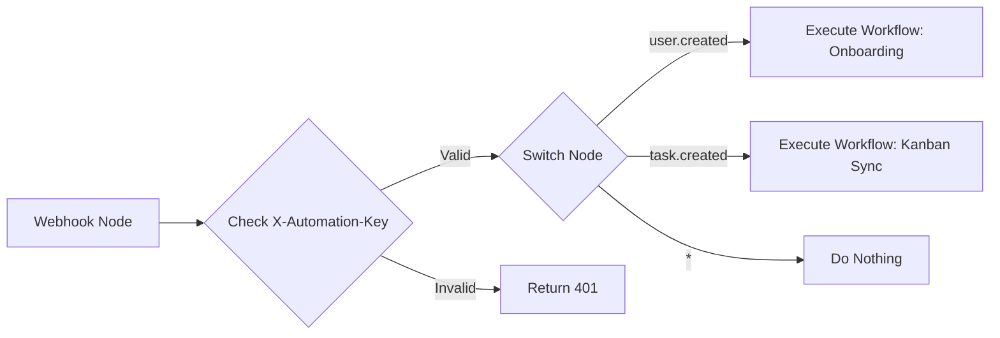
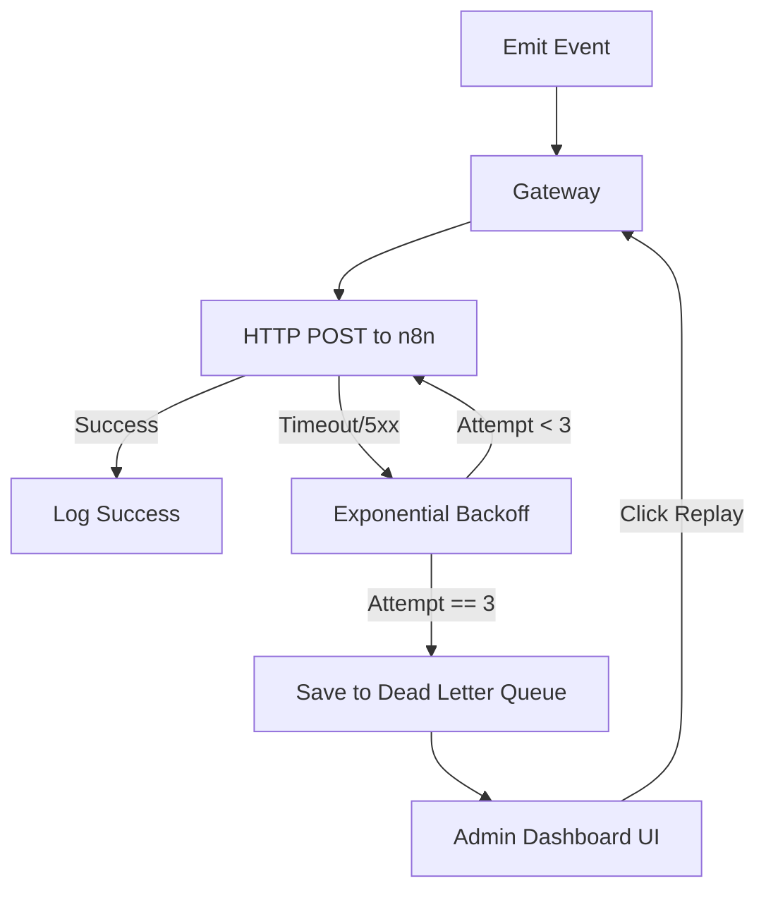

# Nexus Automation System — Production Implementation Guide

This document serves as the single source of truth for the Nexus Automation System architecture. It provides everything a developer needs to understand, deploy, extend, and maintain the event-driven automation layer without needing to deep-dive into the source code first.

---

## 1. System Overview

The Nexus Automation System uses an **event-driven, decoupled architecture**. Rather than hardcoding third-party integrations (like Slack, Discord, or Google Sheets) directly into the Next.js codebase, the application acts as an event emitter. It broadcasts "what happened" to a centralized automation engine, which then decides "what to do."

### Responsibilities

* **Next.js Application**: Handles core business logic, UI, and database interactions. It acts as the **Trigger Engine**, emitting standardized events whenever something important occurs.
* **Automation Gateway**: A resilient middleware layer inside Next.js (`src/lib/automation/client.ts`). It wraps payloads in a standard envelope, handles retries, logs attempts to the database, and routes events to n8n.
* **n8n**: The visual workflow automation engine. It acts as the **Master Router and Integrator**, receiving events from the Gateway, running condition checks, and connecting to external APIs without requiring code changes.
* **Supabase**: The primary database. Stores core business data, but also houses the `automation_logs` table for tracking event status and managing the Dead Letter Queue (DLQ).
* **Resend**: The transactional email provider, utilized via Next.js `/api/automation/workflows/*` endpoints when sending Nexus-branded React emails.

### Why Decouple?
By decoupling the application from the automations, we achieve:
1. **Agility**: Non-developers can build new integrations in n8n visually.
2. **Reliability**: If Slack or Discord goes down, it doesn't crash the Next.js API or break user flows.
3. **Clean Codebase**: The Next.js repository doesn't get polluted with dozens of API SDKs (Google, Slack, Airtable, CRM).

---

## 2. Current Architecture

```mermaid
graph TD
    %% User Actions
    User([User Action]) --> App[Next.js Business Logic]

    subgraph "Next.js Architecture"
        App --> |"emitEvent()"| Gateway[Automation Gateway]
        Gateway --> |"Log status"| DB[(Supabase DB)]
        Gateway --> |"Retry on Failure"| Gateway
        Gateway --> |"Exhausted Retries"| DLQ[Dead Letter Queue]
    end

    %% Network Boundary
    Gateway --> |"HTTP POST"| N8N_Webhook[n8n Master Webhook]

    subgraph "n8n Architecture"
        N8N_Webhook --> N8N_Switch{Master Dispatcher (Switch)}
        
        N8N_Switch --> |"user.*"| WF_Users[Users Sub-workflow]
        N8N_Switch --> |"attendance.*"| WF_Attendance[Attendance Sub-workflow]
        N8N_Switch --> |"task.*"| WF_Kanban[Kanban Sub-workflow]
        N8N_Switch --> |"report.*"| WF_Reports[Reports Sub-workflow]
    end

    %% External Services
    WF_Users --> Email[Resend (via Next.js)]
    WF_Kanban --> Slack[Slack / Discord]
    WF_Attendance --> Sheets[Google Sheets]
```

### Architectural Components
* **Event Emission**: Business logic files import `emitEvent` (server) or `emitClientEvent` (client) and fire it alongside database mutations. It is strictly "fire-and-forget" to prevent blocking the UI.
* **Event Envelope**: Every event is wrapped in a standardized JSON envelope including a unique UUID, timestamp, actor ID, and organization ID for consistent tracing.
* **Retry Flow**: The Gateway uses exponential backoff to retry failed HTTP requests to n8n (handling network blips or cold starts).
* **Logging**: Every attempt, success, and failure is recorded in `automation_logs`.
* **Dead Letter Queue (DLQ)**: If all retries fail (e.g., n8n is offline for hours), the event is marked as a "Dead Letter." Administrators can view and manually replay these events from the Admin Automation Dashboard.

---

## 3. Event Catalog

Nexus currently emits 11 standard events. Every event follows this standard envelope structure:

```json
{
  "id": "uuid-v4",
  "event": "task.completed",
  "actorId": "user-uuid",
  "organizationId": "org-uuid",
  "timestamp": "2026-07-15T00:00:00.000Z",
  "payload": { ... }
}
```

### Registered Events

| Event Name | Type | Payload Highlights | Use Cases |
|---|---|---|---|
| `user.created` | Server | User ID, Email, Role | Welcome emails, CRM creation |
| `user.invited` | Server | Inviter ID, Invitee Email | Invite emails, slack alerts |
| `user.deleted` | Server | User ID, Email | Access revocation, audit logs |
| `organization.created` | Server | Org ID, Org Name, Owner | Billing setup, internal alerts |
| `attendance.clocked_in` | Client | User ID, Timestamp, IP | Timesheet syncing, Slack status |
| `attendance.clocked_out` | Client | User ID, Timestamp | Timesheet completion |
| `task.created` | Client | Task ID, Title, Priority | PM tool sync, Discord alerts |
| `task.assigned` | Client | Task ID, Assignee ID | Notification emails, Slack alerts |
| `task.completed` | Server/Client | Task ID, Completed By | Client reports, performance tracking |
| `task.deleted` | Client | Task ID, Deleted By | Audit logs |
| `report.generated` | Client | Report ID, URL | Email delivery to supervisors |

> [!NOTE]
> Client-side events are routed securely through a Next.js API proxy (`/api/automation/events`) to protect the n8n webhook URL and inject the server-side authentication context.

---

## 4. n8n Architecture

Nexus enforces a **Master Event Dispatcher** pattern in n8n.

### Why a Single Webhook?
Instead of creating 50 different webhook URLs for 50 different automations, Nexus sends *everything* to a single `POST /webhook/events` endpoint in n8n. 
1. **Maintenance**: You only manage one Webhook URL and one API Key in your Next.js `.env`.
2. **Observability**: All incoming traffic passes through one chokepoint, making it easy to monitor volume.

### The Master Router



1. **Webhook Node**: Listens on `POST /webhook/events`.
2. **Authentication**: Verifies the `X-Automation-Key` header matches the internal secret.
3. **Switch Node**: Checks the `{{ $json.body.event }}` field and routes the execution to the appropriate branch.
4. **Execute Workflow Nodes**: Calls independent sub-workflows (e.g., "Slack Notifications", "Email Delivery") to keep the master canvas clean.

---

## 5. Production Deployment

### Next.js Deployment
Deploying the Next.js side is standard (e.g., Vercel). Ensure the following environment variables are set in production:

```env
AUTOMATION_ENABLED=true
AUTOMATION_LOG_LEVEL=full # or errors-only
N8N_URL=https://n8n.yourdomain.com
N8N_API_KEY=your-secure-random-string
AUTOMATION_TIMEOUT=10000
AUTOMATION_RETRIES=3
```

### n8n Deployment Options
n8n requires a persistent server (it cannot be deployed to serverless platforms like Vercel).

* **VPS with Docker Compose (Recommended)**: The most cost-effective and reliable method. Run a $5-$10/mo DigitalOcean/Hetzner instance.
* **Coolify**: Excellent for self-hosting if you prefer a Vercel-like PaaS interface.
* **Railway/Render**: Easiest setup, but requires mounting a persistent volume to avoid losing workflow data on every deploy.

> [!IMPORTANT]
> **Persistence is Mandatory**: n8n stores workflow configurations and execution histories in an SQLite database (by default). If you deploy via Docker without a volume mount, your automations will be deleted on every reboot.

#### Example Production `docker-compose.yml`

```yaml
version: "3.7"
services:
  n8n:
    image: n8nio/n8n:latest
    restart: always
    ports:
      - "5678:5678"
    environment:
      - N8N_HOST=n8n.yourdomain.com
      - N8N_PORT=5678
      - N8N_PROTOCOL=https
      - NODE_ENV=production
      - WEBHOOK_URL=https://n8n.yourdomain.com/
      - GENERIC_TIMEZONE=Asia/Tokyo
    volumes:
      - n8n_data:/home/node/.n8n

volumes:
  n8n_data:
```

*(You will need to place this behind a reverse proxy like Caddy, Traefik, or Nginx to provide SSL).*

---

## 6. Environment Variables

| Variable | Environment | Description |
|---|---|---|
| `AUTOMATION_ENABLED` | Both | `true` or `false`. Kills all gateway outbound requests if false. |
| `AUTOMATION_LOG_LEVEL` | Both | `full`, `minimal`, or `errors-only`. Controls how much DB bloat is created. |
| `N8N_URL` | Both | The base URL to your n8n instance. Local: `http://localhost:5678`. Prod: `https://n8n.domain.com`. |
| `N8N_API_KEY` | Both | A shared secret. Must match the value checked by the n8n Webhook node. |
| `AUTOMATION_TIMEOUT` | Both | Gateway timeout in milliseconds (e.g., `10000`). Prevents hanging Next.js requests. |
| `AUTOMATION_RETRIES` | Both | Number of times to retry a failed fetch before sending to DLQ (e.g., `3`). |

---

## 7. Building New Automations (Extended Guide)

When expanding the system, decide *where* the logic belongs:

1. **Does the automation just send data out?** (e.g., Slack, Sheets)
   → **Build exclusively in n8n.** Drag and drop native nodes. Zero Next.js changes required.
2. **Does the automation require branded Nexus UI/Emails?** (e.g., React Emails via Resend)
   → **Build a Next.js Workflow Endpoint** (`/api/automation/workflows/email/route.ts`). Then, use an n8n HTTP Request node to trigger this endpoint.
3. **Does the trigger event not exist yet?**
   → **Build the Next.js Emitter**. Add to `registry.ts`, inject `emitEvent()` into the business logic, and then catch it in n8n.

### Development Workflow
1. Identify the trigger event.
2. Open n8n, add a branch to the Master Router Switch Node for the event.
3. Use a "Set" node to map the payload to variables.
4. Add the target integration nodes (e.g., Discord).
5. Click "Execute Workflow" in n8n.
6. Trigger the action in the Next.js UI to verify the payload arrives and processes.

---

## 8. Example Automations

### 1. Discord Notification (n8n Only)
* **Goal**: Send a Discord message when a high-priority task is created.
* **Flow**: Master Router -> Switch (`task.created`) -> IF Node (`{{$json.payload.priority}} == 'high'`) -> Discord Node (Send Message to Webhook).
* **Code Changes**: None.

### 2. Welcome Email (Next.js + n8n)
* **Goal**: Send a beautifully designed HTML React email when a user signs up.
* **Flow**: Master Router -> Switch (`user.created`) -> HTTP Request Node (POST to `https://nexus.com/api/automation/workflows/welcome-email`).
* **Code Changes**: Create the endpoint in Next.js that renders the React email and sends via Resend. n8n simply orchestrates the timing.

### 3. Google Sheets Logging (n8n Only)
* **Goal**: Log every clock-in.
* **Flow**: Switch (`attendance.clocked_in`) -> Google Sheets Node (Append Row). Map payload `userId`, `timestamp`, and `ip` to columns A, B, and C.

### 4. CRM Integration (n8n Only)
* **Goal**: Create a HubSpot/Salesforce contact on sign up.
* **Flow**: Switch (`user.created`) -> HubSpot Node (Create Contact). Map payload `email` and `name`.

---

## 9. Reliability Features

The system is designed for **eventual consistency** and high fault tolerance.



* **Fire-and-Forget**: Next.js API routes use `.catch(console.error)` on `emitEvent()` to ensure UI responses are instantaneous.
* **Retries & Backoff**: Handles momentary n8n downtime or Vercel network drops.
* **Dead Letter Queue**: If n8n crashes permanently, no data is lost. The payload is stored in Supabase with `status: failed`. You can replay it with one click from the Admin Dashboard once n8n is restored.

---

## 10. Monitoring & Debugging

**The Dashboard**: Always check `Dashboard -> Admin -> Automation Logs` first.

### Troubleshooting Checklist
1. **Event never shows up in n8n**:
   - Check the Next.js Automation Logs. Is it marked "failed"?
   - Ensure `AUTOMATION_ENABLED=true`.
   - Verify `N8N_URL` is correct and reachable from Vercel/localhost.
2. **Event marked as "Unauthorized" (401)**:
   - Your `N8N_API_KEY` in `.env` does not match the header check in the n8n Webhook node.
3. **Infinite Loading in UI**:
   - You likely added an `await emitEvent(...)` in an API route instead of letting it run in the background. Remove the `await` and add `.catch()`.
4. **n8n workflow failed**:
   - n8n stores historical executions. Go to the n8n dashboard -> Executions, find the failed run, and inspect the node that errored (e.g., Discord API rate limit).

---

## 11. Scaling Strategy

As you add dozens of automations, n8n can become cluttered.

* **Use Sub-workflows**: Do not put 50 nodes in the Master Router. The Master Router should only contain the Switch node and "Execute Workflow" nodes. Create separate workflows like "Workflow: Task Automations" and pass the data to them.
* **Versioning**: If you completely change a payload structure in Next.js, create a new event (e.g., `task.created.v2`) rather than breaking the old one, allowing you to migrate n8n gracefully.
* **Database Pruning**: `AUTOMATION_LOG_LEVEL=full` will grow your Supabase database quickly. In production, consider running a scheduled cron job to delete `automation_logs` older than 30 days, or switch to `errors-only`.

---

## 12. Best Practices

> [!TIP]
> **Keep logic separated.** If an automation calculates payroll or updates a user's database status, that logic belongs in a Next.js API route. n8n should simply *call* that route. Do not put raw SQL queries connecting directly to Supabase inside n8n; use n8n for orchestration, mapping, and external tool delivery.

1. **Avoid Duplication**: Rely on the existing 11 core events rather than creating ultra-specific ones (e.g., use `task.completed` and filter by priority in n8n, rather than creating a `high_priority_task.completed` event).
2. **Backward Compatibility**: Never remove properties from an event payload. If you must change structure, add new properties alongside the old ones to avoid breaking existing n8n workflows.
3. **Testing**: Always use the "Test Node" feature in n8n by pasting a JSON payload from the Next.js DLQ into the webhook node to simulate production traffic.

---

## 13. Future Roadmap

The decoupled nature of this architecture paves the way for advanced enterprise features:

* **Approval Workflows**: n8n can generate "Wait for Webhook" links, send them via Slack, and wait for a manager to click "Approve" before continuing a workflow.
* **Agentic AI & LLMs**: n8n has native LangChain nodes. Future automations could trigger AI to automatically categorize tasks or write summary reports based on `task.completed` payloads.
* **ERP/CRM Pipelines**: Seamlessly mirror Nexus data into external enterprise tools (Salesforce, SAP, Workday) strictly via n8n mapping logic. 
* **MCP Integrations**: As Context Protocols mature, the n8n orchestrator can act as the middleware bridging Nexus context to third-party AI agents.

This architecture ensures Nexus remains lightweight, lightning-fast, and infinitely extensible.
