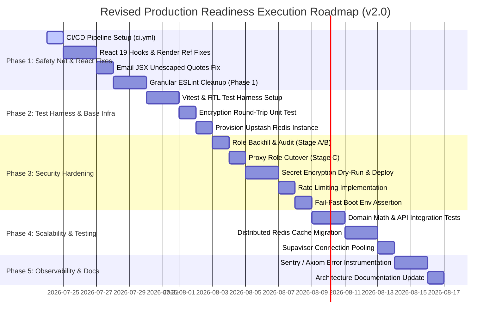

# 🛠️ Nexus (OJT Tracker) — Production Readiness Implementation Plan (v2.0)

> **Source of truth:** Production Readiness Audit Report & Architectural Review (v2.0 Revision)  
> **Target Repository:** `Famanias/nexus` (`ojt-tracker`)  
> **Stack Context:** Next.js 16 (App Router), TypeScript, Supabase Postgres 17 (RLS), Upstash Redis, Material UI + Tailwind, n8n automation engine (Railway), multi-tenant SaaS architecture

---

## 1. Executive Summary

Nexus is architecturally robust (Supabase RLS multi-tenancy, decoupled n8n automation gateway, type-safe Server Actions), but requires strict operational hardening prior to production deployment. 

This **v2.0 Implementation Plan** incorporates critical architectural safeguards:
- **Two-stage authorization cutover** (role backfill → proxy cutover) to prevent accidental admin lockout.
- **Key-management & staging dry-run protocol** for `pgcrypto` secret encryption at rest.
- **Infrastructure provisioning** for shared Upstash Redis (rate limiting & distributed caching).
- **Feature-flag rollback protection** for high-risk migrations.
- **CI-gated test-first ordering**, moving test scaffolding ahead of production data migrations.

---

## 2. Key Architectural Decisions & Safeguards

### 2.1 Key Management Strategy (`organization_integrations` Encryption)
- **Encryption Method**: `pgcrypto` `pgp_sym_encrypt` / `pgp_sym_decrypt` symmetric envelope encryption.
- **Key Location**: Key stored as an environment variable (`INTEGRATION_ENCRYPTION_KEY`) in Vercel / Supabase Vault (never checked into source code or stored in the database).
- **Rotation Strategy**: Symmetric key rotation via database function re-encrypting ciphertext with new key.

### 2.2 Role-Source Backfill & Cutover Plan
- **Stage A (Backfill)**: Run a SQL script populating `profiles.role` and Supabase `app_metadata.role` for all existing users where missing.
- **Stage B (Verification)**: Audit `profiles` table to ensure `0` null or mismatched roles exist.
- **Stage C (Proxy Cutover)**: Update `src/proxy.ts` to enforce `profiles.role` / `app_metadata.role`.

### 2.3 Redis Infrastructure Provisioning
- **Provider**: Upstash Redis (serverless HTTP/REST client via `@upstash/redis`).
- **Shared Footprint**: A single Upstash Redis instance will handle both **API Rate Limiting** (`@upstash/ratelimit`) and **Distributed Integration Cache** (`src/lib/integrations/cache.ts`).

### 2.4 High-Risk Rollback & Feature Flags
- **Secret Encryption**: Dry-run against staging DB snapshot before production execution; maintain unencrypted shadow read path for 1 deploy cycle.
- **Distributed Cache**: Wrapped in feature flag `ENABLE_REDIS_CACHE=true/false` falling back to local `Map` if Redis is unreachable.

---

## 3. Phased Implementation Roadmap

---

## 4. Detailed Task Breakdown

### Phase 1 — Safety Net & React Correctness

#### Task 1.1: Stand up GitHub Actions CI Pipeline (`.github/workflows/ci.yml`) — P0
- **File**: `.github/workflows/ci.yml` [NEW]
- **Action**: Run `npm ci`, `npx eslint .`, `npx tsc --noEmit`, and `npm run build` on PRs to `main`.
- **Validation**: Open test PR with deliberate lint error; confirm CI blocks merge.

#### Task 1.2: Fix React 19 Hooks & Render Ref Access Bugs — P0
- **Files**: 
  - [TaskModal.tsx](file:///d:/repos/ojt-tracker/src/components/kanban/TaskModal.tsx#L74): Remove `setUploadingFiles` call inside `useEffect`.
  - [useAttendance.ts](file:///d:/repos/ojt-tracker/src/lib/hooks/useAttendance.ts#L75): Refactor `refresh()` call out of effect sync.
  - [DateRangePickerButton.tsx](file:///d:/repos/ojt-tracker/src/components/shared/DateRangePickerButton.tsx#L307): Replace render-time `anchorRef.current` access with state binding.
- **Validation**: Verify modal open/close and date picker popovers visually with React DevTools profiler.

#### Task 1.3: Fix Email JSX Unescaped Quotes — P1
- **Files**: `src/emails/InvitationEmail.tsx`, `ReportApprovedEmail.tsx`, `ReportRejectedEmail.tsx`, `TaskRemovedEmail.tsx`
- **Action**: Escape raw quotes with `&apos;` and `&quot;`.

#### Task 1.4: Granular ESLint Cleanup — P1
- **Sub-task 1.4a**: Clean unused imports and variables across `src/components/`.
- **Sub-task 1.4b**: Clean unused imports and explicit `any` types across `src/lib/` and `src/actions/`.
- **Sub-task 1.4c**: Verify `npx eslint .` returns **0 errors**.

---

### Phase 2 — Testing Harness & Base Infrastructure

#### Task 2.1: Install & Configure Vitest + RTL Test Harness — P0
- **Files**: `vitest.config.ts` [NEW], `package.json` [MODIFY], `.github/workflows/ci.yml` [MODIFY]
- **Action**: Install `vitest`, `@testing-library/react`. Wire `npm run test` into CI workflow.

#### Task 2.2: Encryption Round-Trip Unit Test — P0
- **File**: `src/lib/integrations/encryption.test.ts` [NEW]
- **Action**: Write unit test verifying secret encryption/decryption round-trip before executing database migration in Phase 3.

#### Task 2.3: Provision Shared Upstash Redis Infrastructure — P1
- **Action**: Provision Upstash Redis database. Add `UPSTASH_REDIS_REST_URL` and `UPSTASH_REDIS_REST_TOKEN` to `.env.local` and Vercel environment settings. Install `@upstash/redis` and `@upstash/ratelimit`.

---

### Phase 3 — Security Hardening & Data Migrations

#### Task 3.1: Role Backfill & Audit (Stage A/B) — P0
- **File**: `supabase/migrations/20260724000001_backfill_user_roles.sql` [NEW]
- **Action**: Backfill `profiles.role` and Supabase `app_metadata` for all auth users. Run audit query confirming `0` null or unassigned role records exist.

#### Task 3.2: Proxy Role Check Cutover (Stage C) — P1
- **File**: [src/proxy.ts](file:///d:/repos/ojt-tracker/src/proxy.ts)
- **Action**: Cut over route protection from `user_metadata.role` to verified `profiles.role` / `app_metadata.role`.

#### Task 3.3: Secret Encryption Dry-Run & Production Deployment — P0
- **Files**: `supabase/migrations/20260724000002_encrypt_secrets.sql` [NEW], `src/actions/integrations.ts` [MODIFY]
- **Action**: Take database backup. Run dry-run against staging environment. Deploy migration using `INTEGRATION_ENCRYPTION_KEY` env secret.

#### Task 3.4: Implement Rate Limiting on Automation Endpoints — P1
- **Files**: `src/lib/rate-limit.ts` [NEW], `src/app/api/automation/events/route.ts` [MODIFY], `src/app/api/automation/integrations/resolve/route.ts` [MODIFY]
- **Action**: Apply sliding-window rate limit (100 req/min) using shared Upstash Redis instance.

#### Task 3.5: Fail-Fast Environment Variable Assertion — P2
- **File**: [src/lib/supabase/server.ts](file:///d:/repos/ojt-tracker/src/lib/supabase/server.ts)
- **Action**: Add startup validation throwing explicit errors if production Supabase keys are unconfigured.

---

### Phase 4 — Scalability & Testing Buildout

#### Task 4.1: Domain Math & API Integration Test Suite — P0
- **Files**: `src/lib/utils/geo.test.ts` [NEW], `src/app/api/users/route.test.ts` [NEW]
- **Action**: Write unit tests for GPS distance math and integration tests for `/api/users` organization scoping.

#### Task 4.2: Distributed Redis Cache Migration — P1
- **Files**: [src/lib/integrations/cache.ts](file:///d:/repos/ojt-tracker/src/lib/integrations/cache.ts) [MODIFY]
- **Action**: Replace in-memory `Map` with Upstash Redis cache. Wrap behind `ENABLE_REDIS_CACHE` feature flag for instant rollback capability.

#### Task 4.3: Supavisor Connection Pooling & Server.ts Consolidation — P2
- **File**: [src/lib/supabase/server.ts](file:///d:/repos/ojt-tracker/src/lib/supabase/server.ts) [MODIFY]
- **Action**: Consolidate environment assertion (from Task 3.5) with Supavisor transaction pooler connection setup (port 6543) in a single coordinated file update.

---

### Phase 5 — Observability & Documentation

#### Task 5.1: Sentry / Axiom Error Instrumentation — P2
- **File**: `src/lib/observability/sentry.ts` [NEW]
- **Action**: Wrap Next.js Server Actions and API route handlers with Sentry error capture.

#### Task 5.2: Architecture Documentation Update — P3
- **File**: [docs/ARCHITECTURE.md](file:///d:/repos/ojt-tracker/docs/ARCHITECTURE.md) [MODIFY]
- **Action**: Document new CI/CD workflow, Vitest testing patterns, Redis cache topology, and `pgcrypto` key management procedures.

---

## 5. Verification & Rollback Plan

| Task | Automated Verification | Manual Verification | Rollback Strategy |
| :--- | :--- | :--- | :--- |
| **Secret Encryption (3.3)** | `encryption.test.ts` pass | Verify Slack/Discord webhook notifications fire | Revert read path to raw JSONB fallback |
| **Role Cutover (3.2)** | `/api/users/route.test.ts` pass | Attempt `user_metadata` tampering in browser | Revert `proxy.ts` check to previous logic |
| **Redis Cache (4.2)** | Integration test suite pass | Audit multi-instance cache invalidation | Set `ENABLE_REDIS_CACHE=false` env flag |
| **Rate Limiting (3.4)** | Rate limit test script pass | Verify 429 status code on burst traffic | Disable middleware rate limit wrapper |