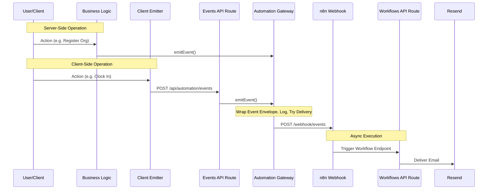

# Nexus Automation System Integration (Phases 1–4)

This walkthrough documents the design and integration details for the event-driven refactor using n8n for Phases 1–4. All existing features remain unchanged and fully operational, and the project builds successfully.

---

## 1. Files Created

We created the following core infrastructure files, API routes, and email templates:

- **Type Definitions**: [types.ts](file:///d:/repos/ojt-tracker/src/lib/automation/types.ts)
  - Contains typed event names (`user.created`, `attendance.clocked_in`, etc.), base event envelope structure (`AutomationEvent`), payload types, and gateway configurations.
- **Event Registry**: [registry.ts](file:///d:/repos/ojt-tracker/src/lib/automation/registry.ts)
  - Catalog of all registered events with validation helpers.
- **Event Logger**: [logger.ts](file:///d:/repos/ojt-tracker/src/lib/automation/logger.ts)
  - A structured console logger with consistent log formats for event emission and gateway events.
- **Retry Utility**: [retry.ts](file:///d:/repos/ojt-tracker/src/lib/automation/retry.ts)
  - Resilient async retry implementation utilizing exponential backoff with jitter.
- **Configuration Reader**: [automation.ts](file:///d:/repos/ojt-tracker/src/lib/config/automation.ts)
  - Reads and validates configuration parameters from environment variables.
- **Gateway Client**: [client.ts](file:///d:/repos/ojt-tracker/src/lib/automation/client.ts)
  - Central communication point. Exposes `emitEvent()`, handles payloads, config checks, and triggers n8n delivery.
- **Public API (Barrel)**: [index.ts](file:///d:/repos/ojt-tracker/src/lib/automation/index.ts)
  - Single import path for using the automation layer (`@/lib/automation`).
- **Client Emitter Helper**: [client-emitter.ts](file:///d:/repos/ojt-tracker/src/lib/automation/client-emitter.ts)
  - Fire-and-forget helper allowing client components to request server-side event emissions.
- **Client Events Route**: [route.ts](file:///d:/repos/ojt-tracker/src/app/api/automation/events/route.ts)
  - API endpoint where `emitClientEvent` sends events. Authenticates requests and emits server-side events.
- **Internal Automation Endpoint**: [route.ts](file:///d:/repos/ojt-tracker/src/app/api/internal/automation/route.ts)
  - Secure callback route for n8n to communicate status/health or trigger CMS operations.

### Emails & Workflows (Phase 4)
- **Email Templates**:
  - [WelcomeEmail.tsx](file:///d:/repos/ojt-tracker/src/emails/WelcomeEmail.tsx)
  - [TaskAssignmentEmail.tsx](file:///d:/repos/ojt-tracker/src/emails/TaskAssignmentEmail.tsx)
  - [AttendanceReminderEmail.tsx](file:///d:/repos/ojt-tracker/src/emails/AttendanceReminderEmail.tsx)
  - [WeeklySummaryEmail.tsx](file:///d:/repos/ojt-tracker/src/emails/WeeklySummaryEmail.tsx)
- **n8n Workflow Handlers**:
  - [welcome-email/route.ts](file:///d:/repos/ojt-tracker/src/app/api/automation/workflows/welcome-email/route.ts)
  - [task-assignment/route.ts](file:///d:/repos/ojt-tracker/src/app/api/automation/workflows/task-assignment/route.ts)
  - [attendance-reminder/route.ts](file:///d:/repos/ojt-tracker/src/app/api/automation/workflows/attendance-reminder/route.ts)
  - [weekly-summary/route.ts](file:///d:/repos/ojt-tracker/src/app/api/automation/workflows/weekly-summary/route.ts)

---

## 2. Files Modified

We integrated event emissions into existing API routes and client-side components:

- [organizations/route.ts](file:///d:/repos/ojt-tracker/src/app/api/organizations/route.ts): Emits `user.created` and `organization.created` events after successful registrations.
- [onboarding/route.ts](file:///d:/repos/ojt-tracker/src/app/api/onboarding/route.ts): Emits `organization.created` events after organization creation.
- [users/route.ts](file:///d:/repos/ojt-tracker/src/app/api/users/route.ts): Emits `user.created` and `user.deleted` events upon creation or deletion by admin.
- [invitations/route.ts](file:///d:/repos/ojt-tracker/src/app/api/invitations/route.ts): Emits `user.invited` event when an administrator creates a new invitation.
- [ClockButton.tsx](file:///d:/repos/ojt-tracker/src/components/attendance/ClockButton.tsx): Emits `attendance.clocked_in` and `attendance.clocked_out` events after clocking.
- [KanbanBoard.tsx](file:///d:/repos/ojt-tracker/src/components/kanban/KanbanBoard.tsx): Emits `task.deleted` when a task is archived.
- [TaskModal.tsx](file:///d:/repos/ojt-tracker/src/components/kanban/TaskModal.tsx): Emits `task.created` and `task.assigned` (for each assigned user) when a task is saved.
- [ReportsClient.tsx](file:///d:/repos/ojt-tracker/src/app/dashboard/reports/ReportsClient.tsx): Emits `report.generated` when report data is exported to CSV.
- [.env.local](file:///d:/repos/ojt-tracker/.env.local): Added new configuration options.

---

## 3. Architecture & Event Flow

The system operates on a clean, decoupled layout:



---

## 4. Automation Gateway Design

All events are wrapped in a generic standard envelope structure:
```json
{
  "id": "event-uuid-v4",
  "event": "attendance.clocked_in",
  "timestamp": "2026-07-14T04:15:00.000Z",
  "organizationId": "org-uuid-or-null",
  "actorId": "user-uuid",
  "payload": {
    "userId": "user-uuid",
    "clockIn": "2026-07-14T04:15:00.000Z",
    "date": "2026-07-14"
  }
}
```

Key gateway features include:
1. **Circuit Breaking / Disabling**: Returns success early with a mock log if `AUTOMATION_ENABLED` is false.
2. **Resilient HTTP Client**: Delivery is wrapped with automatic exponential backoff retry logic.
3. **Structured Logging**: Unified console format mapping requests, retries, and errors.
4. **Decoupled API Routing**: Webhook paths are configured strictly via environment variables.

---

## 5. Environment Variables Added

Add these to your production and local `.env` files:

```env
# ============================================================
# Automation Layer (n8n)
# ============================================================
# Base URL where n8n is deployed (e.g., https://n8n.yourdomain.com)
N8N_URL=

# Secure webhook/API key used to authenticate requests
N8N_API_KEY=

# Set to true to enable the gateway in production
AUTOMATION_ENABLED=false

# Delivery timeouts and retries
AUTOMATION_TIMEOUT=10000
AUTOMATION_RETRIES=3
```

---

## 6. Verification Steps

You can verify the correctness of the automation implementation using the following manual tests:

1. **Gateway Configuration check**:
   Send a `GET` request to `/api/internal/automation`. It should respond with the current enabling/configuration status of the automation layer.
2. **Trace Logging**:
   Trigger any business action (such as Clock In, Create Task, or Export CSV). Observe the server logs; structured trace lines like `[Gateway] request: ...` will appear.
3. **Verify API Route Authentication**:
   Perform a POST request to `/api/internal/automation` without the `X-Automation-Key` header, or with an invalid key. It should return a `401 Unauthorized` response.
4. **Validate Workflow Execution**:
   Call one of the workflow endpoints (e.g. `/api/automation/workflows/welcome-email`) using your configured secret key. It should return a success message or log email deliveries.